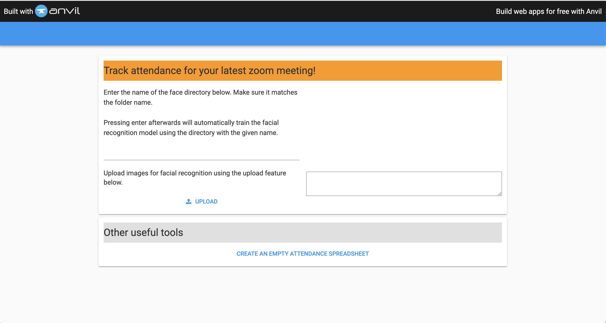

# FaceRec | Codeology Fall 2020 Project
### Project Leaders: Ethan Chen, Krishna Ravi
### Developers: Haotian (Howie) Ye, Michelle Lin, Trevor Baba

## Quick Overview 

This project makes use of Python's face-recognition library. More details about the library can be found at the following link: https://pypi.org/project/face-recognition/. Using the library's deep learning facial recognition technology, we have built an application that will recognise the faces in a zoom classroom screenshot, and record the attendance of the participants. Unknown faces will be flagged and the user (e.g. a teacher) will be notified. 

The project comprises of a iPython Jupyter notebook, where the majority of the code is found, and a simple front-end application that enables easier use for users. 

## To run locally: 

Clone repo - but only the "final_version_files" subdirectory is required for running the application. 
### pip install face-recognition
Store the images of the faces of known "students" in the subdirectory called train_dir. Each "student" should have their own folder, labeled with their name. 
Don't worry about the unknown-male and unknown-female directories. 
The images found in the main final_version_files directory are example images that you can run this product on. These can be simply substitued with screenshots of Zoom classrooms.  

Follow the steps below to run the actual application. 

## Learning Resources
Learning resources for how the face-recognition library works can be found in the Week2, Week4, Week5 subdirectories.

## Primary Technologies Used
- Python
- ML classification principles
- Super-vised learning models 

## Demonstration video
The following link is a YouTube video that demonstrates how the product works. Link: https://youtu.be/Cut46JctCqk

## How the application works

Before running the application, we need to run all the code in the Jupyter Notebook. Using Anaconda, this can be done by opening the Jupyter Notebook and finding the "Cell" tab and hitting "Run All": Cell/Run All.

Next, upon clicking this link: https://6pmvi4vimjgttt72.anvil.app/JJMAACEUPRKI4NY74XO2U4QH , you will be directed to the front-end page of this project. It should appear like this:

Then you can enter the name of the directory that contains the subdirectories of face images of students. In the downloaded directory, it should be called "train_dir". Pressing the return key after entering this directory name should train the facial recognition engine to recognise the faces you have submitted. 

Then you can choose to create an empty attendance spreadsheet by clicking on the blue words as shown in the image below. This creates a simple csv file that will track attendance across various Zoom classroom pictures you upload. The spreadsheet is located in the same final_version_files directory.

That's pretty much it! 

Any questions about this project are welcome at: ethanyxchen@berkeley.edu or krishnaravi@berkeley.edu
